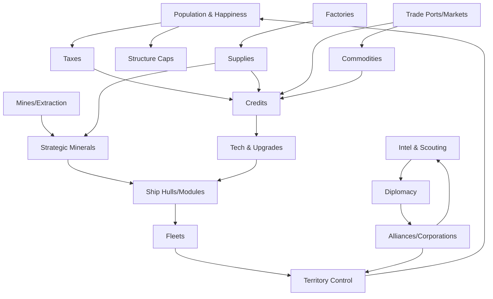

# Space5x Inspiration: VGA Planets and TradeWars 2002

## Executive summary

This document distills two classic, long-running multiplayer space strategy games—**VGA Planets** and **TradeWars 2002 (TW2002)**—into an inspiration reference for **Space5x**.

- **VGA Planets** contributes a **closed-form economic and industrial war machine**: planets extract resources, build structures, and construct ships via starbases, constrained by a global ship limit and build queues that force conflict.
- **TradeWars 2002** contributes an **open-ended, player-driven market and security sandbox**: a sector graph map with asymmetric warp links, a strict per-day turn budget, commodity arbitrage at ports, corporations, alignment (good/evil), and territorial denial.

For Space5x, we treat them as complementary layers:

- Use **VGA Planets-style deterministic empire logistics** as the macro backbone (planets, production, ship construction, simultaneous resolution).
- Use **TW2002-style turn-budgeted operator gameplay** as an active play layer (trade routes, scouting, interdiction, piracy vs law, corp roles).

Recommended Space5x defaults inspired by these games:

- Prefer **asynchronous, simultaneous turns** with a daily (e.g., 24h) cadence and an optional per-cycle action budget to capture TW’s tempo pressure.
- Use **dual economies**: strategic resources (minerals, fuel, supplies, credits) for manufacturing and war, plus tradable commodities for arbitrage and specialization.
- Make **information sharing** a first-class diplomacy mechanic with explicit "share intel" tiers and conservative alliance caps.
- Keep a **fleet limit** (hard or soft+points) to force mid/late wars and maintain readability.

---

## Comparative core loops and design patterns

### Comparative overview table

| Dimension | VGA Planets | TradeWars 2002 (TW2002) | Space5x translation notes |
|---|---|---|---|
| Session model | Asynchronous multiplayer: players submit orders; the server resolves a turn in a strict sequence ("Host Order"). | Real-time interactive, but actions consume **turns** (action points) and players receive a daily allotment; movement typically costs 1 turn per hop. | **Hybrid**: deterministic resolution tick plus per-tick action budget for active play. |
| Map model | 2D coordinate space; scanning depends on sensor ranges; variants include wrap-around and special objects. | Graph of numbered sectors, each with multiple warp links; one-way links are common; configuration controls density and topology. | Treat as **two layers**: macro coordinates (strategic) plus lane networks (shipping lanes). |
| Economy core | Planet production: mines extract minerals, factories produce supplies, defense posts increase defenses; taxation yields money; supplies convertible to money or minerals. | Commodity trading (e.g., Fuel Ore, Organics, Equipment) at ports; planets and ports produce commodities; port regeneration and upgrade costs are key balance levers. | Separate **industrial inputs** (manufacturing) from **trade commodities** (market gameplay). |
| Production constraint | Global ship limits and build queues create scarcity of ship slots and a queue meta. | Soft scaling via turns/day, max ships, corp coordination, and social conflict. | Combine a **clear cap mechanic** with **operational friction** (turn budgets, supply lines). |
| Combat abstraction | Deterministic combat resolved in host order; beams, torpedoes, fighters; mines and storms as hazards. | Fighters, shields, mines, cloaking, sector defenses; combat strongly shaped by intel, logs, and surprise. | Keep deterministic resolution but emphasize **operational warfare** (blockades, logistics denial, intel war). |
| Diplomacy / teams | Formal diplomacy states: share intel, safe passage, full alliance; caps on number of full allies. | Corporations with CEOs, shared assets, internal roles; alignment (good/evil) influences safety and options. | Implement **formal alliances** plus **corporations** as distinct constructs. |
| Victory framing | Defined conditions (e.g., capture a percentage of planets and hold for several turns). | Often community-defined; games end by domination, concession, or tournament rules. | Offer **multiple victory presets** (territory, economic, diplomatic, conquest). |

---

## VGA Planets reference

### Core mechanics and turn structure

VGA Planets is a **simultaneous-planning, host-resolved strategy game**. Players set orders for ships and planets, then the server executes a turn in a fixed "Host Order" sequence. Many interactions depend on when a step occurs, so the order is critical for strategy.

Victory conditions are often based on capturing and holding a percentage of planets for several turns, preventing one-turn flukes.

### Resources and economy system

Key resources:

- **Neutronium** – starship fuel.
- **Duranium / Tritanium / Molybdenum** – hull, component, and weapon construction minerals.
- **MegaCredits (MC)** – general currency for tech and builds.
- **Supplies** – produced by factories; used to build structures; can be sold for MC; can sometimes be converted to minerals.
- **Clans / colonists** and **natives** – affect taxation, happiness, ground combat, and structure caps.

Tax rates and happiness link directly: high tax yields more MC but can trigger riots that destroy structures and halt growth if happiness falls too low.

**Inspiration for Space5x:**

- Use a small, legible set of strategic resources.
- Ensure every ship and structure traces back to population, extraction, and production.

### Production and building mechanics

Planetary structures have simple costs and effects:

- **Mines** – cost supplies and credits; extract minerals based on density and number of mines.
- **Factories** – cost supplies and credits; produce supplies each turn.
- **Defense posts** – cost supplies and credits; improve planetary defenses.

**Starbases** act as industrial hubs:

- Build starships from hulls and components.
- Upgrade tech levels for hulls, engines, beams, and torpedoes.
- Build fighters and defenses.

Costs are data-driven tables, which makes them good candidates for configuration files in Space5x.

### Technology and shipbuilding components

VGA Planets uses starbase tech levels for hulls, engines, beams, and torps. Engines differ in cost and fuel efficiency; higher-tech engines are more efficient at high speeds.

Ships are built as:

- **Hull** (defines mass, cargo, crew, hardpoints).
- **Engines** (fuel use and max warp speed).
- **Beams / Torpedo tubes / Fighter bays** (offense/defense roles).

**Inspiration for Space5x:**

- Use a compositional ship design: chassis + modules.
- Keep the component tables small and data-driven to ease balancing.

### Diplomacy, intel, and fog-of-war

Diplomacy in VGA Planets is heavily tied to **information sharing**:

- Safe passage.
- Share intel (ships/planets and battle outcomes).
- Full alliance (shared intel and combined victory conditions).

Configurable caps limit the number of full allies and intel-sharing partners.

Fog-of-war is created by scan ranges and limited intel; special hazards (storms, minefields) reward scouting and deception.

**Inspiration for Space5x:**

- Make intel-sharing an explicit, configurable diplomatic action.
- Preserve meaningful fog-of-war and counterplay around hazards.

### Configuration and variants

VGA Planets offers many host parameters:

- Scan ranges.
- Alliance caps.
- Minefield behaviors.
- Ship limit and build queue type.

Different build-queue variants (classic priority points, production queues, planetary queues, per-player ship limits) change the balance dramatically.

**Inspiration for Space5x:**

- Treat major queue/fleet-limit styles as **distinct game modes** or presets.

---

## TradeWars 2002 reference

### Core mechanics and turn structure

TW2002 is an **interactive online** space trading and combat game. Key ideas:

- Players receive a limited number of **turns** per day.
- Movement between sectors consumes turns.
- Actions (trading, combat, building) also consume turns.

This creates constant pressure to use turns efficiently.

### Map generation and topology

The universe is a network of sectors:

- Each sector has several warp links; many are one-way.
- Topology (sector count, path lengths, warp densities, port/planet densities) is configurable.

Certain sectors (like "FedSpace" around key ports) are safer and central to early gameplay.

### Economy, resources, and ports

Primary trade commodities include:

- **Fuel Ore**
- **Organics**
- **Equipment**

Ports buy or sell each commodity, indicated by three-letter type codes (Buy/Sell combinations). Special ports handle fighters, shields, holds, and upgrades.

Balance levers:

- Port regeneration rates.
- Maximum production values.
- Upgrade costs.

### Planets, citadels, and infrastructure

Players can create planets and build **citadels**:

- Planets produce commodities and fighters.
- Citadels upgrade in levels and unlock defensive and strategic systems (e.g., sector guns, interdiction, planetary warp).

This allows powerful, player-built infrastructure and strong defensive positions.

### Ships and combat stats

Ships are differentiated by:

- Base cost.
- Turns per warp.
- Max cargo holds.
- Combat odds multiplier.
- Max fighters and shields.
- Mine capacity.
- Transporter range.
- Genesis torpedo capacity.

Only some ships support advanced drives (e.g., transwarp) and certain roles.

**Inspiration for Space5x:**

- Use caps (max cargo, fighters, shields, etc.) as tunable balance levers.
- Tie mobility upgrades (like transwarp) to specific hulls and costs.

### Diplomacy, corporations, and NPCs

Diplomacy is structured around:

- **Corporations** – with CEOs, membership, shared assets, and roles.
- **Alignment** – good vs evil, affecting safety and access.

NPC actors (law enforcement, pirates, traders) create both risk and opportunity.

### Configuration and tools

Admin tools expose many settings:

- Sector count.
- Max ships.
- Turns per day.
- Corp size and limits.
- Cloak failure rates.
- Nav hazard dispersion.
- Port regen and prices.

Players often use helper tools for mapping, automation, and analysis, which becomes part of the meta.

**Inspiration for Space5x:**

- Offer curated presets and guardrails for configuration.
- Expect advanced players to build or use helper tools; design APIs and logs accordingly.

---

## Strategic analysis and balance levers

### Strategic phases in VGA Planets

- **Opening:** focus on mobility (engines) and early planet development (mines, factories, tax management).
- **Midgame:** ship limit approaches; control of build queues and logistics becomes decisive; minefields and hazards shape borders.
- **Late game:** alliances, intel-sharing, and logistics decide the outcome more than small tactical battles.

### Strategic phases in TradeWars 2002

- **Opening:** information and safe income; discovering ports and establishing trade loops; choosing good/evil posture.
- **Midgame:** corporations multiply strength through specialization; planets and citadels support high-capacity trade and defense.
- **Late game:** domination via lockouts, blockades, and control of powerful ships and sectors.

### Key balance levers for Space5x

- **Mobility cost vs payoff** – fuel rules, drive efficiency, turns per move.
- **Production ceilings and scarcity** – fleet limits, turns per day, port regen, and structure caps.
- **Intel and diplomacy transparency** – how much is visible and how easy it is to share.
- **Security and denial tools** – mines, hazards, blockades, interdiction, and their countermeasures.

---

## Space5x design translation and recommendations

### System relationship diagram

This diagram shows how economic, military, and diplomatic loops should feed into each other.

### Recommended defaults for Space5x

| Category | Default | Why |
|---|---|---|
| Turn cadence | 24h simultaneous resolution | Supports async multiplayer and predictable pacing. |
| Action budget | Daily "ops points" or turns per player | Captures TW’s tempo pressure and limits grind. |
| Map size | Worlds per player + neutral density | Scales sessions by player count and target game length. |
| Map topology | Coordinate map + lane overlay | Captures both Planets-style space and TW-style lanes. |
| Resources | Minerals, fuel, supplies, credits, 3 trade goods | Unifies both games’ vocabularies into one system. |
| Diplomacy | Safe passage, share intel, full alliance (cap 1 full ally) | Prevents alliance blobs from trivializing fog-of-war. |
| Fleet cap | Soft cap plus priority points above cap | Forces wars and controls complexity. |
| Hazards | Mines, anomalies, lane interdiction | Provide denial tools with counterplay. |
| Win conditions | Territory, economic, and diplomatic presets | Supports both classic styles (planet capture and domination). |

### Feature priorities

**High priority**

1. Deterministic, simultaneous-turn core with transparent resolution order.
2. Planet-based industrial economy with a small, clear resource set.
3. Fleet cap mechanic to enforce conflict and readability.
4. Diplomacy and intel-sharing tiers with conservative defaults.

**Medium priority**

1. Trade layer with ports/markets and regeneration presets.
2. Corporation/organization layer with roles and shared assets.
3. Operational hazards and denial tools with clear counters.

**Later priority**

1. Rich variant ecosystems and advanced configuration presets.

### Progression flow for a typical game

This flow mirrors the shared macro-arc seen in both VGA Planets and TradeWars 2002.
